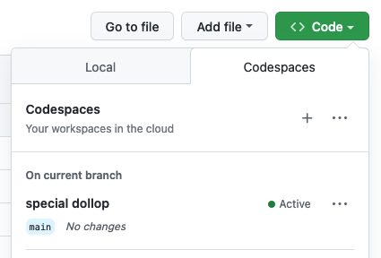
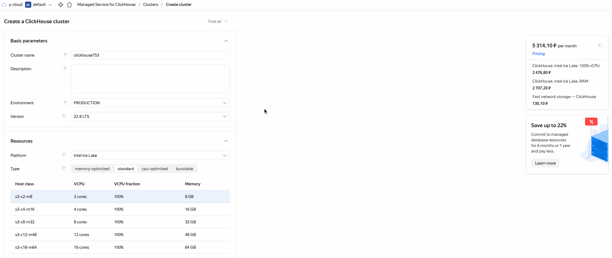
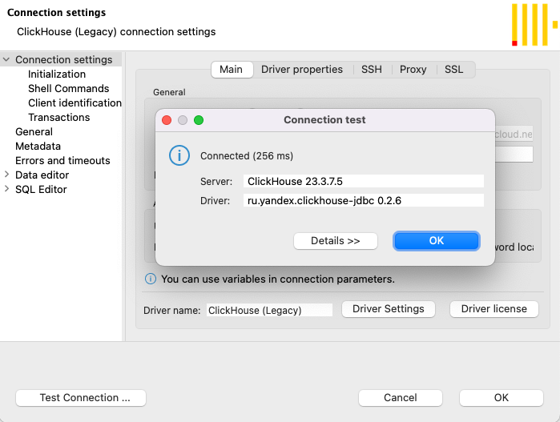
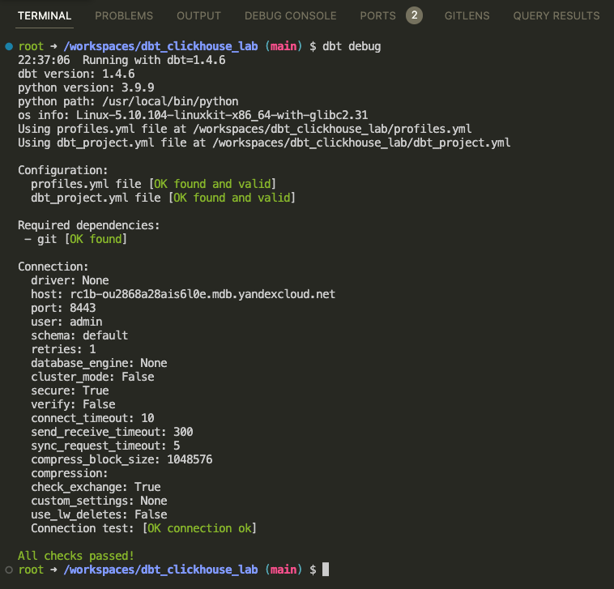
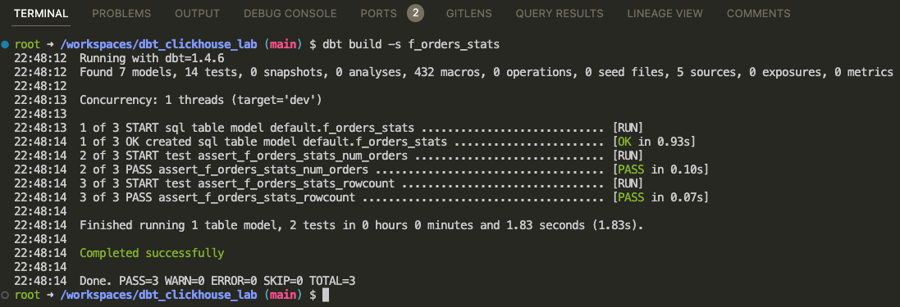
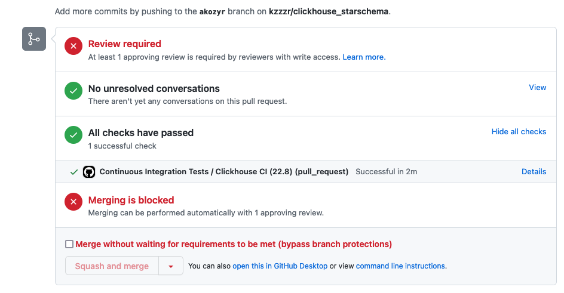

# DWH powered by Clickhouse and dbt

- Build DWH powered by [Clickhouse](https://clickhouse.com/) and [dbt](https://www.getdbt.com/)
- Deploy Infrastructure as Code with [Terraform](https://www.terraform.io/) and [Yandex.Cloud](https://cloud.yandex.com/en-ru/)
- Instant development with [Github Codespaces](https://docs.github.com/en/codespaces)
- Assignment checks with [Github Actions](https://github.com/features/actions)

## Lab plan

- [Fork this repository](https://docs.github.com/en/get-started/quickstart/fork-a-repo)
- [Configure Developer Environment](#1-configure-developer-environment)
    - Start with GitHub Codespaces
    - Use devcontainer (locally)
- [Deploy Infrastructure to Yandex.Cloud with Terraform](#2-deploy-infrastructure-to-yandexcloud-with-terraform)
    - Get familiar with Yandex.Cloud web UI
    - Configure `yc` CLI
    - Populate `.env` file, Set environment variables
    - Deploy using Terraform: Clickhouse
- [Check database connection](#3-check-database-connection)
    - Configure JDBC (DBeaver) connection
    - Configure dbt connection
- [Deploy DWH](#4-deploy-dwh)
    - Install dbt packages
    - Stage data sources with dbt macro
    - Describe sources in [sources.yml](./models/sources/sources.yml) file
    - Build staging models
    - Prepare a data mart (wide table)
- [Model read-optimized Data Mart](#5-model-read-optimized-data-mart)
    - Turn SQL code into dbt model [f_orders_stats](./models/marts/f_orders_stats.sql)
    - Open PR and trigger automated testing with Github Actions
- [Delete cloud resources](#delete-cloud-resources)


## 1. Configure Developer Environment


You have got several options to set up:
 
<details><summary>Start with GitHub Codespaces</summary>
<p>



</p>
</details>

<details><summary>Use devcontainer (locally)</summary>
<p>

1. Install [Docker](https://docs.docker.com/desktop/#download-and-install) on your local machine.

1. Install devcontainer CLI:

    Open command palette (CMD + SHIFT+ P) type *Install devcontainer CLI*

    

1. Next build and open dev container:

    ```bash
    # build dev container
    devcontainer build .

    # open dev container
    devcontainer open .
    ```

</p>
</details>

Verify you are in a development container by running commands:

```bash
terraform -v

yc --version

dbt --version
```

If any of these commands fails printing out used software version then you are probably running it on your local machine not in a dev container!

## 2. Deploy Infrastructure to Yandex.Cloud with Terraform

1. Get familiar with Yandex.Cloud web UI

    We will deploy:
    - [Yandex Managed Service for ClickHouse](https://cloud.yandex.com/en/services/managed-clickhouse)
    
    

1. Configure `yc` CLI: [Getting started with the command-line interface by Yandex Cloud](https://cloud.yandex.com/en/docs/cli/quickstart#install)

    ```bash
    yc init
    ```

1. Populate `.env` file

    `.env` is used to store secrets as environment variables.

    Copy template file [.env.template](./.env.template) to `.env` file:
    ```bash
    cp .env.template .env
    ```

    Open file in editor and set your own values.

    > ❗️ Never commit secrets to git    


1. Set environment variables:

    ```bash
    export YC_TOKEN=$(yc iam create-token)
    export YC_CLOUD_ID=$(yc config get cloud-id)
    export YC_FOLDER_ID=$(yc config get folder-id)
    export $(xargs <.env)
    ```

1. Deploy using Terraform

    Configure YC Terraform provider:
    
    ```bash
    cp terraformrc ~/.terraformrc
    ```

    Get familiar with Cloud Infrastructure: [main.tf](./main.tf) and [variables.tf](./variables.tf)

    ```bash
    terraform init
    terraform validate
    terraform fmt
    terraform plan
    terraform apply
    ```

    Store terraform output values as Environment Variables:

    ```bash
    export CLICKHOUSE_HOST=$(terraform output -raw clickhouse_host_fqdn)
    export DBT_HOST=${CLICKHOUSE_HOST}
    export DBT_USER=${CLICKHOUSE_USER}
    export DBT_PASSWORD=${TF_VAR_clickhouse_password}
    ```

    [EN] Reference: [Getting started with Terraform by Yandex Cloud](https://cloud.yandex.com/en/docs/tutorials/infrastructure-management/terraform-quickstart)
    
    [RU] Reference: [Начало работы с Terraform by Yandex Cloud](https://cloud.yandex.ru/docs/tutorials/infrastructure-management/terraform-quickstart)

## 3. Check database connection

[Configure JDBC (DBeaver) connection](https://cloud.yandex.ru/docs/managed-clickhouse/operations/connect#connection-ide):

```
port=8443
socket_timeout=300000
ssl=true
sslrootcrt=<path_to_cert>
```



Make sure dbt can connect to your target database:

```bash
dbt debug
```



If any errors check ENV values are present:

```bash
env | grep DBT_
```

## 4. Deploy DWH

1. Install dbt packages

    ```bash
    dbt deps
    ```

1. Stage data sources with dbt macro

    Source data will be staged as EXTERNAL TABLES (S3) using dbt macro [init_s3_sources](./macros/init_s3_sources.sql):

    ```bash
    dbt run-operation init_s3_sources
    ```

    Statements will be executed one by one to avoid error:

    ```
    DB::Exception: Syntax error (Multi-statements are not allowed)
    ```

1. Describe sources in [sources.yml](./models/sources/sources.yml) file

1. Build staging models:

    ```bash
    dbt build -s tag:staging
    ```

    Check model configurations: `engine`, `order_by`, `partition_by`

1. Prepare a data mart (wide table)

    Join all the tables into one [f_lineorder_flat](./models/marts/f_lineorder_flat.sql):

    ```bash
    dbt build -s f_lineorder_flat
    ```

    Pay attentions to models being tested for keys being unique, not null.

## 5. Model read-optimized Data Mart

Turn the following SQL into dbt model [f_orders_stats](./models/marts/f_orders_stats.sql):

```sql
SELECT
    toYear(O_ORDERDATE) AS O_ORDERYEAR
    , O_ORDERSTATUS
    , O_ORDERPRIORITY
    , count(DISTINCT O_ORDERKEY) AS num_orders
    , count(DISTINCT C_CUSTKEY) AS num_customers
    , sum(L_EXTENDEDPRICE * L_DISCOUNT) AS revenue
FROM -- PLEASE USE dbt's ref('') to ensure valid DAG execution!
WHERE 1=1
GROUP BY
    toYear(O_ORDERDATE)
    , O_ORDERSTATUS
    , O_ORDERPRIORITY
```

Make sure the tests pass:

```bash
dbt build -s f_orders_stats
```



## 6. Create PR and make CI tests pass

If it works from your terminal, commit, open PR and trigger automated testing with Github Actions



## Delete cloud resources

⚠️ Attention! Always delete cloud resources after you finished!


```bash
terraform destroy
```
