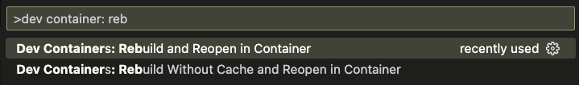

# DWH powered by Clickhouse and dbt

- Build DWH powered by [Clickhouse](https://clickhouse.com/) and [dbt](https://www.getdbt.com/)
- Deploy Infrastructure as Code with [Terraform](https://www.terraform.io/) and [Yandex.Cloud](https://cloud.yandex.com/en-ru/)
- Instant development with [Github Codespaces](https://docs.github.com/en/codespaces)
- Assignment checks with [Github Actions](https://github.com/features/actions)

## Assignment TODO

⚠️ Attention! Always delete resources after you finish your work!

- [ ] [Fork this repository](https://docs.github.com/en/get-started/quickstart/fork-a-repo)
- [ ] [Configure Developer Environment](#1-configure-developer-environment)
- [ ] [Deploy Clickhouse](#2-deploy-clickhouse)
- [ ] [Check database connection](#3-check-database-connection)
- [ ] [Deploy DWH](#4-deploy-dwh)
- [ ] [Model read-optimized data mart](#5-model-read-optimized-data-mart)
- [ ] [Create PR and make CI tests pass](#6-create-pr-and-make-ci-tests-pass)

## 1. Configure Developer Environment

1. You have got 3 options to set up:
 
    <details><summary>Start with GitHub Codespaces / Dev Container:</summary>
    <p>

    Open in Github Codespace:

    

    Or open in a local Dev Container (VS Code):

    

    </p>
    </details>

    <details><summary>Set up Docker containers manually:</summary>
    <p>

    Install [Docker](https://docs.docker.com/desktop/#download-and-install) and run commands:

    ```bash
    # build & run container
    docker-compose build
    docker-compose up -d

    # alias docker exec command
    alias dbt="docker-compose exec dev dbt"
    ```

    </p>
    </details>

    <details><summary>Alternatively, install on a local machine:</summary>
    <p>

    1. [Install dbt](https://docs.getdbt.com/dbt-cli/install/overview)

        [Configure profile](https://docs.getdbt.com/dbt-cli/configure-your-profile) manually by yourself. By default, dbt expects the `profiles.yml` file to be located in the `~/.dbt/` directory. Use this [template](./profiles.yml) and enter your own credentials.

    1. Intsall [yc CLI](https://cloud.yandex.com/en-ru/docs/cli/operations/install-cli)

    1. Install [Terraform](https://developer.hashicorp.com/terraform/tutorials/aws-get-started/install-cli)

    </p>
    </details>

1. Populate `.env` file

    `.env` is used to store secrets as environment variables.

    Copy template file [.env.template](./.env.template) to `.env` file:
    
    ```bash
    cp .env.template .env
    ```

    Open file in editor and set your own values.

    > ❗️ Never commit secrets to git    

## 2. Deploy Clickhouse

1. Get familiar with Managed Clickhouse Management Console

    

1. Install and configure `yc` CLI: [Getting started with the command-line interface by Yandex Cloud](https://cloud.yandex.com/en/docs/cli/quickstart#install)

    ```bash
    yc init
    ```

1. Set environment variables:

    ```bash
    export YC_TOKEN=$(yc iam create-token)
    export YC_CLOUD_ID=$(yc config get cloud-id)
    export YC_FOLDER_ID=$(yc config get folder-id)
    export $(xargs <.env)
    ```

1. Deploy using Terraform

    cp terraformrc ~/.terraformrc
    ```bash
    terraform init
    terraform validate
    terraform fmt
    terraform plan
    terraform apply
    ```

    Store terraform output values as Environment Variables:

    ```bash
    export CLICKHOUSE_HOST=$(terraform output -raw clickhouse_host_fqdn)
    export DBT_HOST=${CLICKHOUSE_HOST}
    export DBT_USER=${CLICKHOUSE_USER}
    export DBT_PASSWORD=${TF_VAR_clickhouse_password}
    ```

    [EN] Reference: [Getting started with Terraform by Yandex Cloud](https://cloud.yandex.com/en/docs/tutorials/infrastructure-management/terraform-quickstart)
    
    [RU] Reference: [Начало работы с Terraform by Yandex Cloud](https://cloud.yandex.ru/docs/tutorials/infrastructure-management/terraform-quickstart)


## 3. Check database connection

Make sure dbt can connect to your target database:

```bash
dbt debug
```

[Configure JDBC (DBeaver) connection](https://cloud.yandex.ru/docs/managed-clickhouse/operations/connect#connection-ide):

```
port=8443
socket_timeout=300000
ssl=true
sslrootcrt=<path_to_cert>
```

If any errors check ENV values are present:
```
docker-compose exec dev env | grep DBT_
```

## 4. Deploy DWH

1. Install dbt packages

    ```bash
    dbt deps
    ```

1. Stage data sources with dbt macro

    Source data will be staged as EXTERNAL TABLES (S3) using dbt macro [init_s3_sources](./macros/init_s3_sources.sql):

    ```bash
    dbt run-operation init_s3_sources
    ```

    Statements will be run separately from a list to avoid error:

    ```
    DB::Exception: Syntax error (Multi-statements are not allowed)
    ```

1. Describe sources in [sources.yml](./models/sources/sources.yml) files

1. Build staging models:

    ```bash
    dbt build -s tag:staging
    ```

    Check model configurations: `engine`, `order_by`, `partition_by`

1. Prepare wide table (Data Mart)

    Join all the tables into one [f_lineorder_flat](./models/):

    ```bash
    dbt build -s f_lineorder_flat
    ```

    Pay attentions to models being tested for keys being unique, not null.

## 5. Model read-optimized Data Mart

Turn the following SQL into dbt model [f_orders_stats](./models/marts/f_orders_stats.sql):

```sql
SELECT
    toYear(O_ORDERDATE) AS O_ORDERYEAR
    , O_ORDERSTATUS
    , O_ORDERPRIORITY
    , count(DISTINCT O_ORDERKEY) AS num_orders
    , count(DISTINCT C_CUSTKEY) AS num_customers
    , sum(L_EXTENDEDPRICE * L_DISCOUNT) AS revenue
FROM f_lineorder_flat
WHERE 1=1
GROUP BY
    toYear(O_ORDERDATE)
    , O_ORDERSTATUS
    , O_ORDERPRIORITY
```

Make sure the tests pass:

```bash
dbt build -s f_orders_stats
```

## 6. Create PR and make CI tests pass


## Shut down your cluster

⚠️ Attention! Always delete resources after you finish your work!


```bash
terraform destroy
```

## Lesson plan

- [ ] Deploy Clickhouse
- [ ] Configure development environment
- [ ] Configure dbt project (`dbt_project.yml`)
- [ ] Configure connection (`profiles.yml`)
- [ ] Prepare source data files (S3)
- [ ] Configure EXTERNAL TABLES (S3)
- [ ] Describe sources in .yml files
- [ ] Basic dbt models and configurations
- [ ] Code compilation + debugging
- [ ] Prepare STAR schema
- [ ] Querying results
- [ ] Testing & Documenting your project
